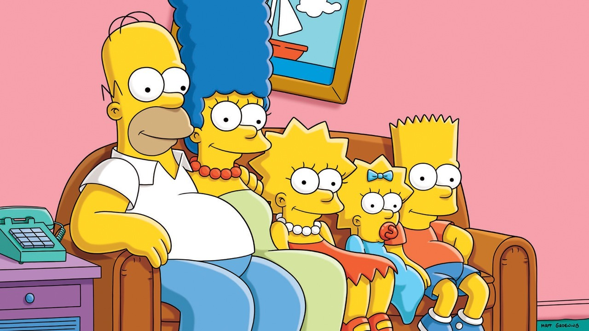

# dodger-game
My first project for General Assembly, a javascript game.

Play here: https://gbasgaard.github.io/dodger-game/

MVP: 
Host my game on github so that it’s playable. Have a game where the objective is to dodge enemies bouncing around the screen at random for as long as you can. Once you come in contact with an enemy end the game and display the score the time. 

Technologies Utilized: HTML, CSS, JavaScript, and jQuery

User Stories: 
As a player, I want to have access to this game via the Internet and be able to pass the time.

Unsolved Problems: 
How to implement session storage to keep a leaderboard.
How to keep enemies from stalling when they first show up.
Maintaining collision detection when Bart is stationary.

Pseudocode:
Change cursor to custom image.
Control character with cursor movement/key strokes.
Have enemies fly around screen in random directions.
Stop game if enemies hit your character.

